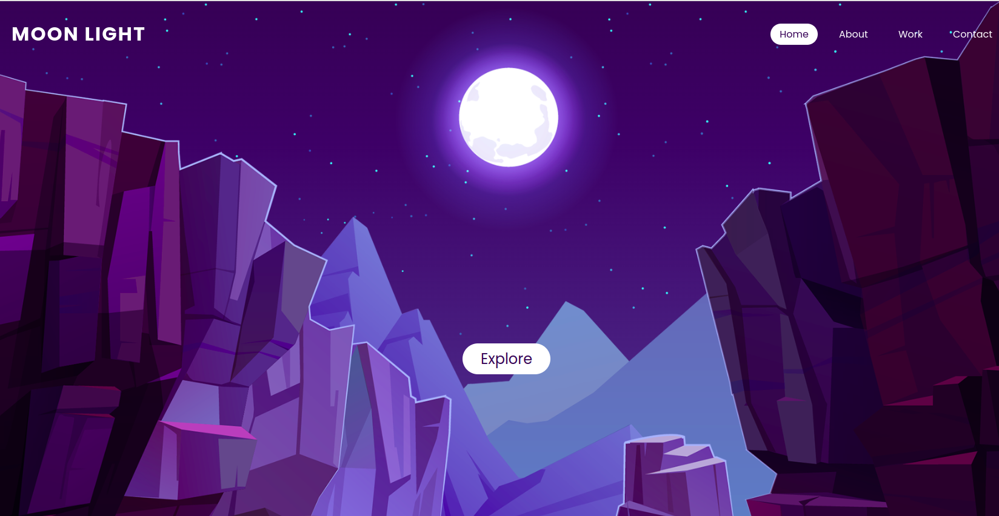

<h1 align="center">
   
  
   
Parallax-Scrolling-Website
 
</h1>
<h4 align="center">Le défilement parallaxe est une technique de conception Web où les éléments de la page se déplacent à des vitesses différentes pour créer un effet de profondeur et de mouvement.

L'effet parallaxe est créé en superposant plusieurs couches d'éléments qui bougent à des vitesses différentes lorsque l'utilisateur fait défiler la page. Les couches avant se déplacent plus rapidement que les couches arrière, créant ainsi un effet de perspective et de profondeur.</h4>

 
Pour ce programme les technologies suivantes ont été utilisé :  

